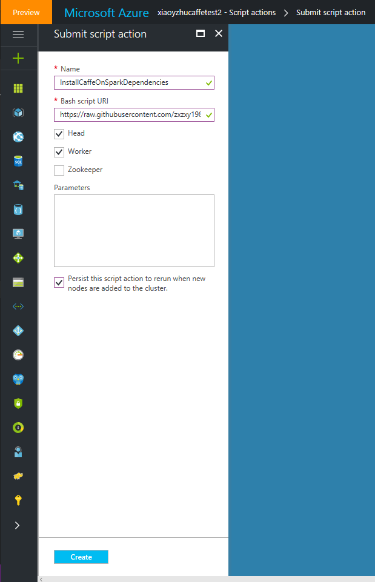
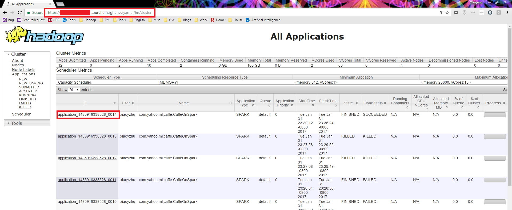
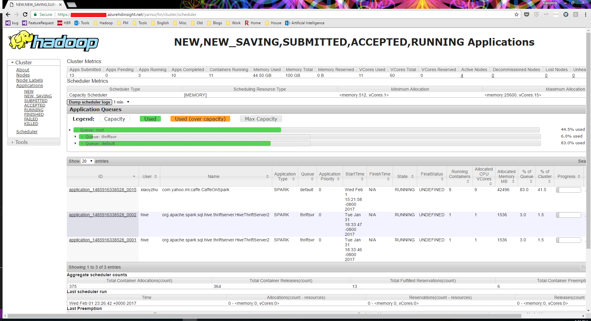
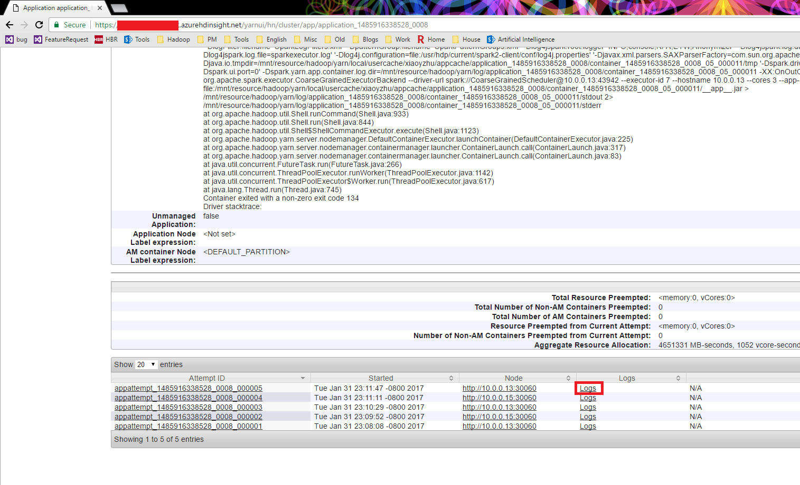

# Distributed Deep Learning on HDInsight with Caffe on Spark

## Introduction

Deep learning is impacting everything from healthcare to transportation to manufacturing, and more. Companies are turning to deep learning to solve hard problems, like [image classification](http://blogs.microsoft.com/next/2015/12/10/microsoft-researchers-win-imagenet-computer-vision-challenge/), [speech recognition](http://googleresearch.blogspot.jp/2015/08/the-neural-networks-behind-google-voice.html), object recognition, and machine translation. 

There are [many popular frameworks](https://en.wikipedia.org/wiki/Comparison_of_deep_learning_software), including [Microsoft Cognitive Toolkit](https://www.microsoft.com/en-us/research/product/cognitive-toolkit/), [Tensorflow](https://www.tensorflow.org/), MXNet, Theano, etc. Caffe is one of the most famous non-symbolic (imperative) neural network frameworks, and widely used in computer vision area. 

[HDInsight](https://azure.microsoft.com/en-us/services/hdinsight/) is the only fully-managed cloud Hadoop offering that provides optimized open source analytic clusters for Spark, Hive, MapReduce, HBase, Storm, Kafka, and R Server backed by a 99.9% SLA. Each of these big data technologies and ISV applications are easily deployable as managed clusters with enterprise-level security and monitoring.

Some users are asking us about how to use deep learning on HDInsight, which is Microsoft's PaaS Hadoop product. We will have more to share in the future, but today we want to summarize a technical blog on how to use Caffe on HDInsight Spark.

If you have installed Caffe before, you will notice that installing this framework is a little bit challenging. In this blog, we will first illustrate how to install [Caffe on Spark](https://github.com/yahoo/CaffeOnSpark) for an HDInsight cluster, then use the built-in MNIST demo to demostrate how to use Distributed Deep Learning using HDInsgiht Spark on CPUs.

There are four major steps to get it work on HDInsight.

1. Install the required dependencies on all the nodes
2. Build Caffe on Spark for HDInsight on the head node
3. Distribute the required libraries to all the worker nodes
4. Compose a Caffe model and run it distributely

Since HDInsight is a PaaS solution, it offers great platform features - so it is quite easy to perform some tasks. One of the features that we heavily use in this blog post is called [Script Action](https://docs.microsoft.com/en-us/azure/hdinsight/hdinsight-hadoop-customize-cluster-linux), with which you can execute shell commands to customize cluster nodes (head node, worker node, or edge node).

## Step 1:  Install the required dependencies on all the nodes

To get started, we need to install the dependencies we need. The Caffe site and [CaffeOnSpark site](https://github.com/yahoo/CaffeOnSpark/wiki/GetStarted_yarn) offers some very useful wiki for installing the dependencies for Spark on YARN mode (which is the mode for HDInsight Spark), but we need to add a few more dependencies for HDInsight platform. We will use the script action as below and run it on all the head nodes and worker nodes. This script action will take about 20 minutes, as those dependencies also depend on other packages. I put the script in my [GitHub location](https://raw.githubusercontent.com/zxzxy1988/CaffeOnSparkOnHDInsight/master/ScriptActionsInstallingDependencies) so it is accessible by the cluster.

    #!/bin/bash
    #Please be aware that installing the below will add additional 20 mins to cluster creation because of the dependencies
    #installing all dependencies, including the ones mentioned in http://caffe.berkeleyvision.org/install_apt.html, as well a few packages that are not included in HDInsight, such as gflags, glog, lmdb, numpy
    #It seems numpy will only needed during compilation time, but for safety purpose we install them on all the nodes

    sudo apt-get install -y libprotobuf-dev libleveldb-dev libsnappy-dev libopencv-dev libhdf5-serial-dev protobuf-compiler maven libatlas-base-dev libgflags-dev libgoogle-glog-dev liblmdb-dev build-essential  libboost-all-dev python-numpy python-scipy python-matplotlib ipython ipython-notebook python-pandas python-sympy python-nose

    #install protobuf
    wget https://github.com/google/protobuf/releases/download/v2.5.0/protobuf-2.5.0.tar.gz
    sudo tar xzvf protobuf-2.5.0.tar.gz -C /tmp/
    cd /tmp/protobuf-2.5.0/
    sudo ./configure
    sudo make
    sudo make check
    sudo make install
    sudo ldconfig
    echo "protobuf installation done"

There are two steps in the script action above. The first step is to install all the required libraries. Those libraries include the necessary libraries for both compiling Caffe(such as gflags, glog) and running Caffe (such as numpy). We are using libatlas for CPU optimization, but you can always follow the CaffeOnSpark wiki on installing other optimization libraries, such as MKL or CUDA (for GPU).

The second step is to download, compile, and install protobuf 2.5.0 for Caffe during runtime. Protobuf 2.5.0 [is required](https://github.com/yahoo/CaffeOnSpark/issues/87), however this version is not available as a package on Ubuntu 16, so we need to compile it from the source code. There are also a few resources on the Internet on how to compile it, such as [this](http://jugnu-life.blogspot.com/2013/09/install-protobuf-25-on-ubuntu.html)

To simply get started, you can just run this script action against your cluster to all the worker nodes and head nodes (for HDInsight 3.5). You can either run the script actions for a running cluster, or you can also run the script actions during the cluster provision time. For more details on the script actions, please see the documentation [here](https://docs.microsoft.com/en-us/azure/hdinsight/hdinsight-hadoop-customize-cluster-linux#view-history-promote-and-demote-script-actions)

## Step 2: Build Caffe on Spark for HDInsight on the head node

The second step is to build Caffe on the headnode, and then distribute the compiled libraries to all the worker nodes. In this step, you will need to [ssh into your headnode](https://docs.microsoft.com/en-us/azure/hdinsight/hdinsight-hadoop-linux-use-ssh-unix), then simply follow the [CaffeOnSpark build process](https://github.com/yahoo/CaffeOnSpark/wiki/GetStarted_yarn), and below is the script I use to build CaffeOnSpark with a few additional steps. 

    #!/bin/bash
    git clone https://github.com/yahoo/CaffeOnSpark.git --recursive
    export CAFFE_ON_SPARK=$(pwd)/CaffeOnSpark

    pushd ${CAFFE_ON_SPARK}/caffe-public/
    cp Makefile.config.example Makefile.config
    echo "INCLUDE_DIRS += ${JAVA_HOME}/include" >> Makefile.config
    #Below configurations might need to be updated based on actual cases. For example, if you are using GPU, or using a different BLAS library, you may want to update those settings accordingly.
    echo "CPU_ONLY := 1" >> Makefile.config
    echo "BLAS := atlas" >> Makefile.config
    echo "INCLUDE_DIRS += /usr/include/hdf5/serial/" >> Makefile.config
    echo "LIBRARY_DIRS += /usr/lib/x86_64-linux-gnu/hdf5/serial/" >> Makefile.config
    popd

    #compile CaffeOnSpark
    pushd ${CAFFE_ON_SPARK}
    #always clean up the environment before building (especially when rebuiding), or there will be errors such as "failed to execute goal org.apache.maven.plugins:maven-antrun-plugin:1.7:run (proto) on project caffe-distri: An Ant BuildException has occured: exec returned: 2"
    make clean 
    #the build step usually takes 20~30 mins, since it has a lot maven dependencies
    make build 
    popd
    export LD_LIBRARY_PATH=${CAFFE_ON_SPARK}/caffe-public/distribute/lib:${CAFFE_ON_SPARK}/caffe-distri/distribute/lib

    hadoop fs -mkdir -p wasb:///projects/machine_learning/image_dataset

    ${CAFFE_ON_SPARK}/scripts/setup-mnist.sh
    hadoop fs -put -f ${CAFFE_ON_SPARK}/data/mnist_*_lmdb wasb:///projects/machine_learning/image_dataset/

    ${CAFFE_ON_SPARK}/scripts/setup-cifar10.sh
    hadoop fs -put -f ${CAFFE_ON_SPARK}/data/cifar10_*_lmdb wasb:///projects/machine_learning/image_dataset/

    #put the already compiled CaffeOnSpark libraries to wasb storage, then read back to each node using script actions. This is because CaffeOnSpark requires all the nodes have the libarries
    hadoop fs -mkdir -p /CaffeOnSpark/caffe-public/distribute/lib/
    hadoop fs -mkdir -p /CaffeOnSpark/caffe-distri/distribute/lib/
    hadoop fs -put CaffeOnSpark/caffe-distri/distribute/lib/* /CaffeOnSpark/caffe-distri/distribute/lib/
    hadoop fs -put CaffeOnSpark/caffe-public/distribute/lib/* /CaffeOnSpark/caffe-public/distribute/lib/

I actually do more than what the documentation of CaffeOnSpark says. The changes are:
- I have changed to CPU only and use libatlas for this particular purpose.
- I put the datasets to the BLOB storage, which is a shared location that is accessible to all worker nodes for later use.
- I put the compiled Caffe Libraries to the BLOB storage, and I will copy those libraries to all the nodes using script actions to avoid additional compilation time.

### Troubleshooting: An Ant BuildException has occured: exec returned: 2

When I was first trying to build CaffeOnSpark, sometimes it will say

    failed to execute goal org.apache.maven.plugins:maven-antrun-plugin:1.7:run (proto) on project caffe-distri: An Ant BuildException has occured: exec returned: 2

Simply clean the code repository by "make clean" and then run "make build" will solve this issue, as long as you have the correct dependencies.

### Troubleshooting: Maven repository connection time out

Sometimes maven gives me the connection time out error, similar to below:

    Retry:
    [INFO] Downloading: https://repo.maven.apache.org/maven2/com/twitter/chill_2.11/0.8.0/chill_2.11-0.8.0.jar
    Feb 01, 2017 5:14:49 AM org.apache.maven.wagon.providers.http.httpclient.impl.execchain.RetryExec execute
    INFO: I/O exception (java.net.SocketException) caught when processing request to {s}->https://repo.maven.apache.org:443: Connection timed out (Read failed)

It will be OK after I wait for a few minutes and then just rebuild the code, so I suspect it might be Maven somehow limits the traffic from a given IP address.

### Troubleshooting: Test failure for Caffe

You probably will see a test failure when doing the final check for CaffeOnSpark, similar with below. This is prabably related with UTF-8 encoding, but should not impact the usage of Caffe

    Run completed in 32 seconds, 78 milliseconds.
    Total number of tests run: 7
    Suites: completed 5, aborted 0
    Tests: succeeded 6, failed 1, canceled 0, ignored 0, pending 0
    *** 1 TEST FAILED ***

## Step 3: Distribute the required libraries to all the worker nodes

The next step is to distribute the libraries (basically the libraries in CaffeOnSpark/caffe-public/distribute/lib/ and CaffeOnSpark/caffe-distri/distribute/lib/) to all the nodes. In Step 2, we put those libraries on BLOB storage, and in this step, we will use script actions to copy it to all the head nodes and worker nodes.

To do this, simple run a script action as below (you need to point to the right location specific to your cluster):

    #!/bin/bash
    hadoop fs -get wasb:///CaffeOnSpark /home/xiaoyzhu/

Because in step 2, we put it on the BLOB storage which is accessible to all the nodes, in this step we just simply copy it to all the nodes.

## Step 4: Compose a Caffe model and run it distributely

After running the above steps, Caffe is alreay installed on the headnode and we are good to go. The next step is to write a Caffe model. 

Caffe is using an "expressive architecture", where for composing a model, you just need to define a configuration file, and without coding at all (in most cases). So let's take a look there. 

The model we will train today is a sample model for MNIST training. The MNIST database of handwritten digits has a training set of 60,000 examples, and a test set of 10,000 examples. It is a subset of a larger set available from NIST. The digits have been size-normalized and centered in a fixed-size image. CaffeOnSpark has some scripts to download the dataset and convert it into the right format.

CaffeOnSpark provides some network topologies example for MNIST training. There are two files required: 

the "configuration" file (${CAFFE_ON_SPARK}/data/lenet_memory_solver.prototxt) defines whether CPU or GPU will be used, what's the momentum, how many iterations will be, etc. It also defies which neuron network topology should the program use (which is the second file we need).

For this example, since we are using CPU rather than GPU, we should change the last line to:

    # solver mode: CPU or GPU
    solver_mode: CPU

You can change other lines as needed.

The second file (${CAFFE_ON_SPARK}/data/lenet_memory_train_test.prototxt) defines how the neuron network looks like, and the relevant input and output file. We also need to update the file to reflect the training data location. Change the following part in lenet_memory_train_test.prototxt (you need to point to the right location specific to your cluster):

- change the "file:/Users/mridul/bigml/demodl/mnist_train_lmdb" to "wasb:///projects/machine_learning/image_dataset/mnist_train_lmdb"
- change "file:/Users/mridul/bigml/demodl/mnist_test_lmdb/" to "wasb:///projects/machine_learning/image_dataset/mnist_test_lmdb"

For more information on how to define the network, please check the [Caffe documentation](http://caffe.berkeleyvision.org/tutorial/)

For the purpose of this blog, we just use this simple MNIST example. You should run the command below from the head node:

    spark-submit --master yarn --deploy-mode cluster --num-executors 8 --files ${CAFFE_ON_SPARK}/data/lenet_memory_solver.prototxt,${CAFFE_ON_SPARK}/data/lenet_memory_train_test.prototxt --conf spark.driver.extraLibraryPath="${LD_LIBRARY_PATH}" --conf spark.executorEnv.LD_LIBRARY_PATH="${LD_LIBRARY_PATH}" --class com.yahoo.ml.caffe.CaffeOnSpark ${CAFFE_ON_SPARK}/caffe-grid/target/caffe-grid-0.1-SNAPSHOT-jar-with-dependencies.jar -train -features accuracy,loss -label label -conf lenet_memory_solver.prototxt -devices 1 -connection ethernet -model wasb:///mnist.model -output wasb:///mnist_features_result

Basically it distributes the required files (lenet_memory_solver.prototxt and lenet_memory_train_test.prototxt) to each YARN container, and also set the relevant PATH of each Spark driver/executor to LD_LIBRARY_PATH, which is defined in the previous code snippet and points to the location that has CaffeOnSpark libraries. 

## Monitoring and Troubleshooting

Since we are using YARN cluster mode, in which case the Spark driver will be scheduled to an arbitrary container (and an arbitrary worker node) you should only see in the console outputting something like:

    17/02/01 23:22:16 INFO Client: Application report for application_1485916338528_0015 (state: RUNNING)

If you want to know what happened, then you usually need to get the Spark driver's log, which has more information. In this case, you need to go to the YARN UI to find the relevant YARN logs. You can get the YARN UI by this URL: 

    https://yourclustername.azurehdinsight.net/yarnui
   

In this case, after clicking the "Scheduler" link, you can see that for this application, there are 9 containers running. We ask YARN to provide 8 executors, and another container is for driver process. 

You may want to check the  driver logs or container logs if there are failures. For driver logs, you can click the application ID in YARN UI, then click the "Logs" button. The driver logs are written into stderr.

For example, you might see some of the error below from the driver logs, indicating you allocate too many executors.

    17/02/01 07:26:06 ERROR ApplicationMaster: User class threw exception: java.lang.IllegalStateException: Insufficient training data. Please adjust hyperparameters or increase dataset.
    java.lang.IllegalStateException: Insufficient training data. Please adjust hyperparameters or increase dataset.
        at com.yahoo.ml.caffe.CaffeOnSpark.trainWithValidation(CaffeOnSpark.scala:261)
        at com.yahoo.ml.caffe.CaffeOnSpark$.main(CaffeOnSpark.scala:42)
        at com.yahoo.ml.caffe.CaffeOnSpark.main(CaffeOnSpark.scala)
        at sun.reflect.NativeMethodAccessorImpl.invoke0(Native Method)
        at sun.reflect.NativeMethodAccessorImpl.invoke(NativeMethodAccessorImpl.java:62)
        at sun.reflect.DelegatingMethodAccessorImpl.invoke(DelegatingMethodAccessorImpl.java:43)
        at java.lang.reflect.Method.invoke(Method.java:498)
        at org.apache.spark.deploy.yarn.ApplicationMaster$$anon$2.run(ApplicationMaster.scala:627)

Sometimes, the issue can happen in executors rather than drivers. In this case, you need to check the container logs. You can always get the driver container logs, and then get the failed container. For example, I met this failure when I was running Caffe.

    17/02/01 07:12:05 WARN YarnAllocator: Container marked as failed: container_1485916338528_0008_05_000005 on host: 10.0.0.14. Exit status: 134. Diagnostics: Exception from container-launch.
    Container id: container_1485916338528_0008_05_000005
    Exit code: 134
    Exception message: /bin/bash: line 1: 12230 Aborted                 (core dumped) LD_LIBRARY_PATH=/usr/hdp/current/hadoop-client/lib/native:/usr/hdp/current/hadoop-client/lib/native/Linux-amd64-64:/home/xiaoyzhu/CaffeOnSpark/caffe-public/distribute/lib:/home/xiaoyzhu/CaffeOnSpark/caffe-distri/distribute/lib /usr/lib/jvm/java-8-openjdk-amd64/bin/java -server -Xmx4608m '-Dhdp.version=' '-Detwlogger.component=sparkexecutor' '-DlogFilter.filename=SparkLogFilters.xml' '-DpatternGroup.filename=SparkPatternGroups.xml' '-Dlog4jspark.root.logger=INFO,console,RFA,ETW,Anonymizer' '-Dlog4jspark.log.dir=/var/log/sparkapp/${user.name}' '-Dlog4jspark.log.file=sparkexecutor.log' '-Dlog4j.configuration=file:/usr/hdp/current/spark2-client/conf/log4j.properties' '-Djavax.xml.parsers.SAXParserFactory=com.sun.org.apache.xerces.internal.jaxp.SAXParserFactoryImpl' -Djava.io.tmpdir=/mnt/resource/hadoop/yarn/local/usercache/xiaoyzhu/appcache/application_1485916338528_0008/container_1485916338528_0008_05_000005/tmp '-Dspark.driver.port=43942' '-Dspark.history.ui.port=18080' '-Dspark.ui.port=0' -Dspark.yarn.app.container.log.dir=/mnt/resource/hadoop/yarn/log/application_1485916338528_0008/container_1485916338528_0008_05_000005 -XX:OnOutOfMemoryError='kill %p' org.apache.spark.executor.CoarseGrainedExecutorBackend --driver-url spark://CoarseGrainedScheduler@10.0.0.13:43942 --executor-id 4 --hostname 10.0.0.14 --cores 3 --app-id application_1485916338528_0008 --user-class-path file:/mnt/resource/hadoop/yarn/local/usercache/xiaoyzhu/appcache/application_1485916338528_0008/container_1485916338528_0008_05_000005/__app__.jar > /mnt/resource/hadoop/yarn/log/application_1485916338528_0008/container_1485916338528_0008_05_000005/stdout 2> /mnt/resource/hadoop/yarn/log/application_1485916338528_0008/container_1485916338528_0008_05_000005/stderr

    Stack trace: ExitCodeException exitCode=134: /bin/bash: line 1: 12230 Aborted                 (core dumped) LD_LIBRARY_PATH=/usr/hdp/current/hadoop-client/lib/native:/usr/hdp/current/hadoop-client/lib/native/Linux-amd64-64:/home/xiaoyzhu/CaffeOnSpark/caffe-public/distribute/lib:/home/xiaoyzhu/CaffeOnSpark/caffe-distri/distribute/lib /usr/lib/jvm/java-8-openjdk-amd64/bin/java -server -Xmx4608m '-Dhdp.version=' '-Detwlogger.component=sparkexecutor' '-DlogFilter.filename=SparkLogFilters.xml' '-DpatternGroup.filename=SparkPatternGroups.xml' '-Dlog4jspark.root.logger=INFO,console,RFA,ETW,Anonymizer' '-Dlog4jspark.log.dir=/var/log/sparkapp/${user.name}' '-Dlog4jspark.log.file=sparkexecutor.log' '-Dlog4j.configuration=file:/usr/hdp/current/spark2-client/conf/log4j.properties' '-Djavax.xml.parsers.SAXParserFactory=com.sun.org.apache.xerces.internal.jaxp.SAXParserFactoryImpl' -Djava.io.tmpdir=/mnt/resource/hadoop/yarn/local/usercache/xiaoyzhu/appcache/application_1485916338528_0008/container_1485916338528_0008_05_000005/tmp '-Dspark.driver.port=43942' '-Dspark.history.ui.port=18080' '-Dspark.ui.port=0' -Dspark.yarn.app.container.log.dir=/mnt/resource/hadoop/yarn/log/application_1485916338528_0008/container_1485916338528_0008_05_000005 -XX:OnOutOfMemoryError='kill %p' org.apache.spark.executor.CoarseGrainedExecutorBackend --driver-url spark://CoarseGrainedScheduler@10.0.0.13:43942 --executor-id 4 --hostname 10.0.0.14 --cores 3 --app-id application_1485916338528_0008 --user-class-path file:/mnt/resource/hadoop/yarn/local/usercache/xiaoyzhu/appcache/application_1485916338528_0008/container_1485916338528_0008_05_000005/__app__.jar > /mnt/resource/hadoop/yarn/log/application_1485916338528_0008/container_1485916338528_0008_05_000005/stdout 2> /mnt/resource/hadoop/yarn/log/application_1485916338528_0008/container_1485916338528_0008_05_000005/stderr

        at org.apache.hadoop.util.Shell.runCommand(Shell.java:933)
        at org.apache.hadoop.util.Shell.run(Shell.java:844)
        at org.apache.hadoop.util.Shell$ShellCommandExecutor.execute(Shell.java:1123)
        at org.apache.hadoop.yarn.server.nodemanager.DefaultContainerExecutor.launchContainer(DefaultContainerExecutor.java:225)
        at org.apache.hadoop.yarn.server.nodemanager.containermanager.launcher.ContainerLaunch.call(ContainerLaunch.java:317)
        at org.apache.hadoop.yarn.server.nodemanager.containermanager.launcher.ContainerLaunch.call(ContainerLaunch.java:83)
        at java.util.concurrent.FutureTask.run(FutureTask.java:266)
        at java.util.concurrent.ThreadPoolExecutor.runWorker(ThreadPoolExecutor.java:1142)
        at java.util.concurrent.ThreadPoolExecutor$Worker.run(ThreadPoolExecutor.java:617)
        at java.lang.Thread.run(Thread.java:745)

    Container exited with a non-zero exit code 134

In this case, you need to get the failed container ID (in the above case, it is container_1485916338528_0008_05_000005). Then you need to run 

    yarn logs -containerId container_1485916338528_0008_03_000005

from the headnode. After checking container failure, I realize that I use GPU mode because I forget to change the mode in lenet_memory_solver.prototxt.

    17/02/01 07:10:48 INFO LMDB: Batch size:100
    WARNING: Logging before InitGoogleLogging() is written to STDERR
    F0201 07:10:48.309725 11624 common.cpp:79] Cannot use GPU in CPU-only Caffe: check mode.

## Getting results

Since we are allocating 8 executors, and the network topology is simple, it should only take around 30 minutes to run the result. From the command line, you can see that we put the model to wasb:///mnist.model, and put the results to a folder named wasb:///mnist_features_result.

You can get the results by running

    hadoop fs -cat hdfs:///mnist_features_result/*

and the result looks like:

    {"SampleID":"00009597","accuracy":[1.0],"loss":[0.028171852],"label":[2.0]}
    {"SampleID":"00009598","accuracy":[1.0],"loss":[0.028171852],"label":[6.0]}
    {"SampleID":"00009599","accuracy":[1.0],"loss":[0.028171852],"label":[1.0]}
    {"SampleID":"00009600","accuracy":[0.97],"loss":[0.0677709],"label":[5.0]}
    {"SampleID":"00009601","accuracy":[0.97],"loss":[0.0677709],"label":[0.0]}
    {"SampleID":"00009602","accuracy":[0.97],"loss":[0.0677709],"label":[1.0]}
    {"SampleID":"00009603","accuracy":[0.97],"loss":[0.0677709],"label":[2.0]}
    {"SampleID":"00009604","accuracy":[0.97],"loss":[0.0677709],"label":[3.0]}
    {"SampleID":"00009605","accuracy":[0.97],"loss":[0.0677709],"label":[4.0]}

The SampleID represents the ID in the MNIST dataset, and the label is the number that the model identifies.

## Conclusion

In this blog, I walk you through installing CaffeOnSpark and we run a simple example. HDInsight is a full managed cloud distributed compute platform, and is the best place for running machine learning and advanced analytics workloads, such as [R Server on HDInsight](https://azure.microsoft.com/en-us/services/hdinsight/r-server/), [Spark ML](https://blogs.technet.microsoft.com/machinelearning/2016/06/09/end-to-end-data-science-using-spark-on-azure-hdinsight/), etc. We will have more to share in the future, and feel free to drop any comments and feedbacks to xiaoyzhu at microsoft dot com.

